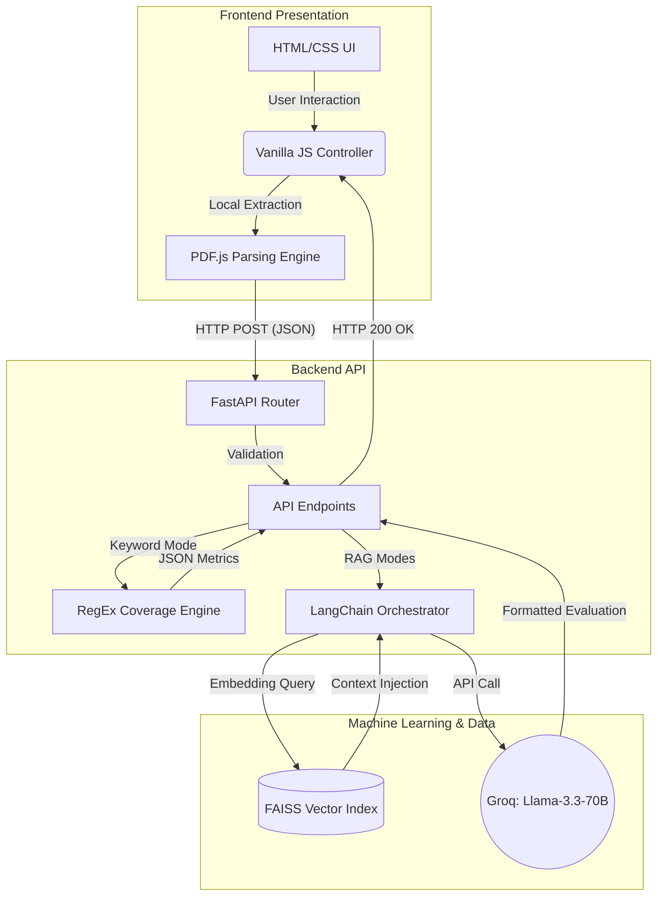

# Software Architecture & System Specification: ATS Resume Analyzer

**Document Version:** 1.0.0
**Project Name:** AI-Powered AST Resume Analyzer (RAG)
**Classification:** Technical Documentation / System Overview
**Target Audience:** Software Engineers, Product Managers, Stakeholders

---

## 1. Executive Summary

The **ATS Resume Analyzer** is an enterprise-grade applicant tracking optimization platform powered by Artificial Intelligence. Designed to demystify automated hiring software (ATS), the system provides candidates with quantitative evaluations, structural design strategies, and critical keyword gap analysis. 

The application diverges from basic Generative AI wrappers by implementing a **Retrieval-Augmented Generation (RAG)** pipeline. It establishes a factual baseline by cross-referencing candidate input against a localized vector database of 2,400+ real-world professional resumes, ensuring that all AI-generated scores and feedback are grounded in empirical industry standards.

---

## 2. System Architecture Overview

The system employs a decoupled, client-server decoupled architecture to ensure rapid responsiveness, secure file parsing, and isolated machine-learning environments.

### 2.1 Component Diagram

### 2.2 Technology Stack

| Layer | Technologies Utilized | Protocol / Standard |
| :--- | :--- | :--- |
| **Frontend/UI** | HTML5, CSS3, JavaScript (Vanilla), PDF.js CDN | HTTP/REST |
| **Backend/API** | Python 3, FastAPI, Uvicorn (ASGI) | REST / JSON |
| **AI/Orchestration** | LangChain Core, PromptTemplates | API |
| **Data & Retrieval** | FAISS, Pandas, SentenceTransformers (`all-MiniLM-L6-v2`) | Local Binary Indexing |
| **Large Language Model** | Llama-3.3-70B-Versatile (via Groq Cloud) | Serverless Inference |

---

## 3. Core Functional Modules

The system provides six distinct evaluation vectors (Functions/Modes), orchestrated dynamically via backend Prompting Templates.

### 3.1 Evaluative Functions (LLM-Driven)

1. **Strategic Review Module (`review`)**
   - **Mechanism:** Implements a 15-year Senior HR persona prompt.
   - **Output:** Identifies qualitative strengths, critical weaknesses, and overall role alignment.
2. **Actionable Optimization Module (`optimize`)**
   - **Mechanism:** Implements a Career Coaching persona prompt.
   - **Output:** Generates concrete rewrite strategies, bullet-point restructuring, and high-priority action items.
3. **ATS RAG Scoring Module (`score`)**
   - **Mechanism:** Triggers the FAISS local database. Embeds the user resume, retrieves the top 3 nearest historical neighbors, and injects them alongside the user input.
   - **Output:** Produces a quantitative grade (0-100), explicitly referencing the historical baseline.
4. **Cultural & Technical Job Fit Module (`fit`)**
   - **Mechanism:** Performs a direct comparative analysis between the resume's tonal/tenure indicators and the Job Description.
   - **Output:** Yields a Cultural Fit Estimate and Experience Fit Grade out of 10.
5. **Design & Formatting Module (`design`)**
   - **Mechanism:** Assesses structural layout markers independently of the target job description.
   - **Output:** Recommends modern template styles (e.g., standard vs. creative) and layout topologies.
6. **Localization Module (`translate`)**
   - **Mechanism:** Utilizes linguistic capabilities of the Llama-3 model.
   - **Output:** Fully translated professional documents available in 10+ global languages while preserving original syntax.

### 3.2 Analytical Functions (Deterministic)

7. **Keyword Intersection Engine (`keywords`)**
   - **Mechanism:** Bypasses the LLM entirely. Utilizes deterministic Python Regular Expressions (RegEx) mapped against an English Stopword exclusion filter minimum-length boundaries (len > 3).
   - **Output:** Instantaneous quantitative percentage mapping of "Matched" vs "Missing" Job Description keywords.

---

## 4. User Interaction & Data Flow Lifecycle

> [!NOTE]
> For data privacy and performance, no raw binary PDF files are ever transferred over the network. All optical character recognition/text-extraction happens locally on the user's Client Machine.

1. **Initialization & Client Access:**
   - User accesses the application via web browser. The frontend initiates an asynchronous health check `/api/health` to confirm the availability of the FAISS Vector Index.
2. **Data Ingestion:**
   - User uploads a `.pdf` file. The frontend `PDF.js` worker extracts raw textual data entirely client-side.
   - User inputs the target Job Description via the provided text area.
3. **Execution Command:**
   - User selects an analytical function via the interface tab controller. 
   - A standardized JSON payload containing `mode`, `resume_text`, and `job_desc` is securely POSTed to `/api/analyze`.
4. **Processing & Feedback:**
   - Backend logic validates the payload and routes to the appropriate analytical module.
   - Upon LLM or RegEx completion, structural DOM elements (Metrics Cards, Keyword Chips, Formatted Output Panels) are dynamically rendered on the user interface.
